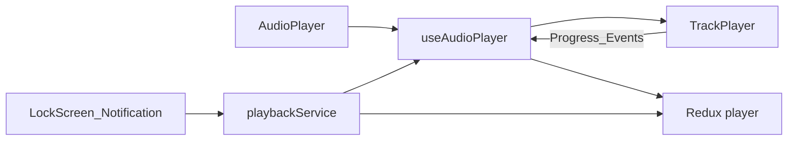

# Audio player (react-native-track-player)

Audiobook playback uses **react-native-track-player** (RNTP) v4.1.2 for HLS streaming, in-app controls, lock screen, and Android media notifications.

## Architecture

- **Playback:** RNTP loads `master.m3u8` per chapter with `Authorization: Bearer` headers.
- **UI state:** Redux [`store/player.ts`](../store/player.ts) drives the [`AudioPlayer`](../components/AudioPlayer.tsx) UI.
- **Remote controls:** [`services/playbackService.ts`](../services/playbackService.ts) handles lock screen / notification events.
- **Preferences:** [`store/settings.ts`](../store/settings.ts) — skip duration (5s / 10s / 15s), persisted via redux-persist.



## Supported controls

| Control | In-app | Lock screen / notification |
| ------- | ------ | -------------------------- |
| Play / Pause | Yes | Yes |
| Seek scrubber | Yes | Yes |
| Skip forward / back | Yes (configurable seconds) | Yes |
| Previous / next chapter | Yes | Yes |

Skip duration is configured under **Account → Playback** (5s, 10s, or 15s).

## Developer setup

### Requirements

- Expo **development build** (Expo Go is not supported)
- **New Architecture enabled** (`newArchEnabled: true` in `app.config.ts`, `android/gradle.properties`, `ios/Podfile.properties.json`) — required by Reanimated 4.x / Worklets

### Install and native rebuild

```bash
npm install
npx expo prebuild --clean
npx expo run:android
# or npx expo run:ios
```

### Entry point

[`index.js`](../index.js) registers the playback service before Expo Router:

```js
TrackPlayer.registerPlaybackService(() => require('./services/playbackService'));
import 'expo-router/entry';
```

### Playback URL

RNTP does **not** load the remote `playlist.m3u8` URL directly. The app fetches the playlist via the API, **fixes malformed segment URLs** (backslashes and duplicated `bit_transcode/.../128k/` paths from the server), writes a normalized file to the device cache, and plays that `file://` playlist. See [`utils/m3u8Normalize.ts`](../utils/m3u8Normalize.ts) and [`utils/chapterStreamUrl.ts`](../utils/chapterStreamUrl.ts).

`postinstall` runs **patch-package** on `react-native-track-player@4.1.2`:

1. **TurboModule (New Arch):** `@ReactMethod` methods must not use `= scope.launch { ... }` (returns `Job`). The patch converts them to block bodies so methods return `Unit`.
2. **Kotlin null-safety:** `Bundle?` handling for `getTrack` / `getQueue` / `getActiveTrack` on RN 0.81.

Patch: [`patches/react-native-track-player+4.1.2.patch`](../patches/react-native-track-player+4.1.2.patch). To regenerate after editing `node_modules`, run `node scripts/patch-rntp-music-module.js` then `npx patch-package react-native-track-player`.

### iOS background audio

`UIBackgroundModes: ['audio']` in [`app.config.ts`](../app.config.ts).

## Key files

| File | Role |
| ---- | ---- |
| `hooks/useAudioPlayer.ts` | Load chapter, events, seek, chapter skip |
| `hooks/useTrackPlayerSetup.ts` | `setupPlayer`, capabilities, jump intervals |
| `services/playbackService.ts` | Remote event handlers |
| `services/trackPlayerController.ts` | Bridge from service to hook |
| `utils/chapterNavigation.ts` | Next/prev chapter, auto-advance |
| `components/AudioPlayer.tsx` | In-app player UI |

## Troubleshooting

| Issue | Fix |
| ----- | --- |
| `TrackPlayerModule` / `TurboModuleInteropUtils$ParsingException` | Ensure `newArchEnabled: true` and the RNTP patch is applied (`npm install` runs `patch-package`). Rebuild the dev client. |
| `assertNewArchitectureEnabledTask` (Reanimated / Worklets) | Set `newArchEnabled: true`; do not disable New Arch for RNTP alone — use the TurboModule patch instead. |
| No audio | Check streaming URL and auth token; verify dev client includes RNTP |
| Skip interval wrong on lock screen | Change setting in Account → Playback; options refresh via `updateTrackPlayerOptions` |
| Android SDK not found | Add `android/local.properties` with `sdk.dir=...` |

## Testing checklist

1. Play a chapter — audio and notification metadata appear.
2. Lock device — play/pause, scrub, skip, next/prev work.
3. Change skip duration to 5s and 15s — in-app labels and remote skips update.
4. Let chapter end — auto-advance to next chapter when available.
5. Close player — playback pauses; reopen resumes from Redux state.

## References

- [react-native-track-player](https://github.com/doublesymmetry/react-native-track-player)
- [Getting started](https://rntp.dev/docs/basics/getting-started)
